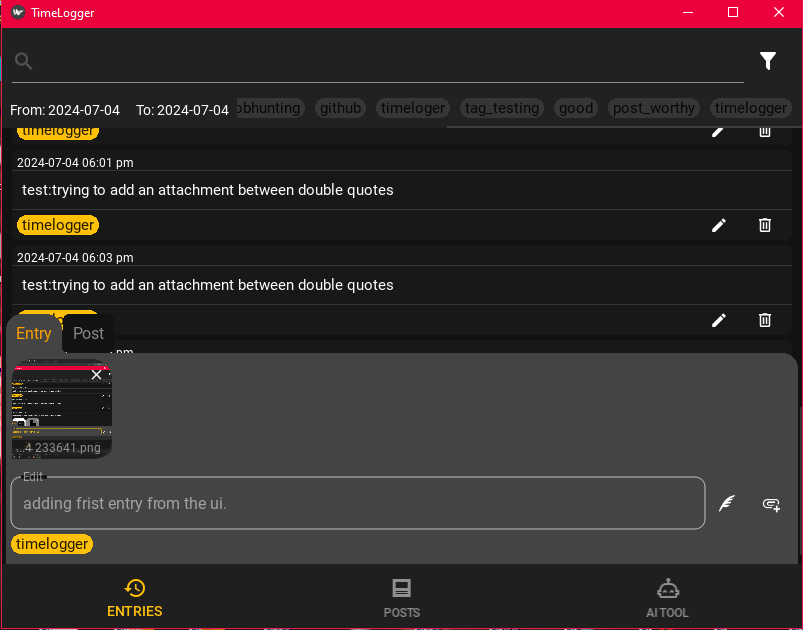

# Time Logger  

This Is a text-based time tracker application for documenting your day.  
It is designed for quick input to remove any friction for using it.  
Use tags to separate and group your entries.  

### Soon
This application will also be able to use your filtered entries to generate social media posts.  
That, and it will have a chat with an LLM (most likely LLaMa 2) to provide you with insight on your days.  


## Features

#### Working Features
1. Write new entries in few seconds.
2. Tag entries.
3. Search and filter entries with date and tags.
4. Attach files to entries.
5. Generate social media posts from your loaded entries.
6. Post on X.
7. Post on LinkedIn.
8. Chat about your day(s) with a chatbot with access to your loaded entries.


#### Under Development
1. Continuous Logging. 
2. Post on Facebook.


#### Ideas:
1. Dairy Tab.
2. Control the application with the chat.
3. Blog Editor (Integrated with Hashnode)


## Usage
## Console Application
When you open the console application, it will load up all your entries form current day.
the cursor will be located after the current time, there you can write your space-separated tags (Optional).  
Once you hit enter you can start writing your new entry.
While writing an entry you can add more tags by writing them after double percentage sign "%%", 
and attach files using double multiplication sign "**" before a path wrapped in
double quotes or without spaces.  
**_Like So:_**
```
2024-07-08:

    08:10 am: example_tag
        Example entry text
    
    09:09 am: advertising
        An entry with more tags %%new_tag and attachments **path/to/related/file.pdf
    
```
>#### Note: 
>you can attach an image from the clipboard by writing "**clp"
> in the entry (only on console application) 

## GUI Application 
The UI is quit straightforward except for adding tags you'll need to use "%%" in the edit box in order to add them.  
Also you can't yet add an image from the clipboard.  




